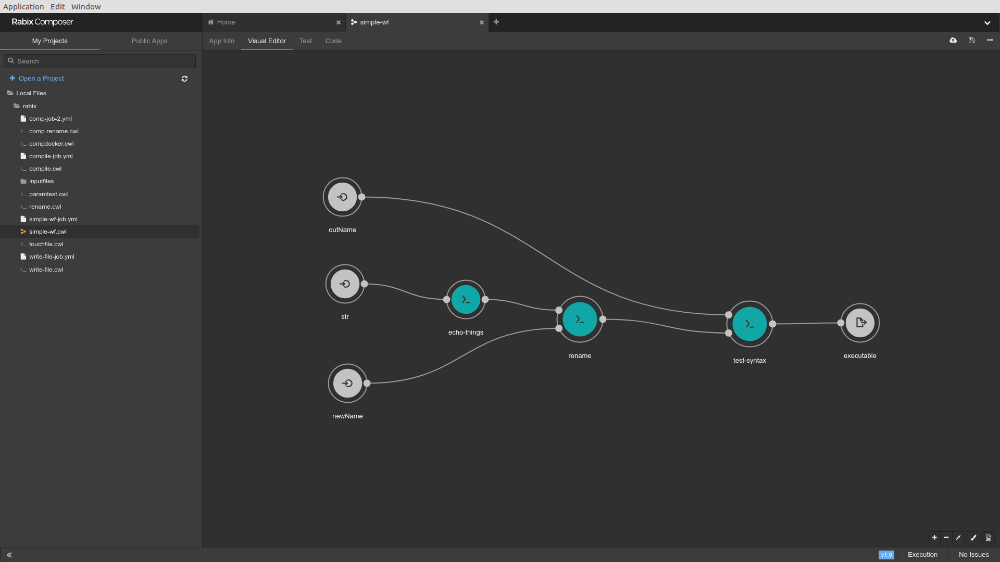

# The cwl-funflow Project

This is an implementation of a subset of the
[Common Workflow Language](https://www.commonwl.org/) using
[Funflow](https://github.com/tweag/funflow) as a backend.

The executable we provide is called ``ffcwlrunner``.

Executing ``ffcwlrunner cwlfile.cwl job.yml`` runs the CWL workflow or
tool ``cwlfile.cwl`` with the input job file ``job.yml``.


## Installation

### System Requirements

To install and use ``ffcwlrunner``, your system needs these:

* [stack](https://docs.haskellstack.org/en/stable/README/)
* [git](https://git-scm.com/book/en/v2/Getting-Started-Installing-Git)
* [docker](https://www.docker.com/)


### Install Process

```bash
$ git clone git@github.com:tweag/funflow-interface.git
$ cd funflow-interface
$ stack install
```

## Why?

1. Our CWL implementation capitalizes on some of `funflow`'s advantages.
   Namely, `ffcwlrunner` has some caching to avoid repeated work, the ability
   to nicely distribute computation and internally has typed verification of
   the  composition that happens in CWL workflows.


2.  CWL has several nice visualization tools and UIs that effectively allow
    data scientists to write powerful workflows easily, and then execute and
    edit them with all the power of Funflow.


## Restrictions: Our Subset of CWL

We only support a subset of the CWL specification. We lay out exactly what is
supported here. To understand CWL, take a look at the official specification or
the user guide available [here](https://www.commonwl.org/v1.0/).

The CWL specification uses the YAML format for its tool or workflow files. So,
we describe our restrictions by specifying which fields we support and what
types those fields must hold. Again, note that this is a subset of the CWL
specification; we are specifying which valid CWL files will work with
`ffcwlrunner`.

Usually, our specification just makes more basic fields required and supports
fewer obscure optional fields.

**It's critical to note that excessive fields are ignored. For example, we do not support the InitialWorkDir requirement so a CWL file that has this requirement will not behave as expected.**


### Command Line Tool Files

#### Required:

These are the required fields we support.

- **class** must be the string "CommandLineTool"
- **id** must be some unique string (all ids are unique in a file)
- **inputs** is a list of inputs, with a few changes
   - **id** is required
   - **type** is required
   - **inputBinding** only supports two fields:
      - **position** which is *required*
      - **prefix** which is optional
- **outputs** has a few changes
   - **id** is required
   - **type** is required
   - **outputBinding** is required and it has exactly one field:
      - **glob** is required
- **baseCmd** is required

#### Optional:

These are the only optional fields we support.

- **stdout** is optional but must be a literal string and *not* a reference
  like `$(inputs.someinput)`.
- **arguments** is optional. If it is provided, it must be an array of strings.
  If no position is specified, these arguments come directly after the base
  command.
- **requirements** is optional.


#### Significant Changes:

- There are no runtime environment references
- **stdout** must be a literal string
- We don't support any All outputs must be obtained through globing.
- All positions must be unique. This makes the ordering of command line
  arguments explicit and organized. If this is not the case, **the executable will refuse to accept the cwl tool**.


### Workflow Files

Workflows must have the following form:

- **class** must be the string "Workflow"
- **inputs** is an array of YAML objects that have two fields
   - **id** for a unique id among the inputs
   - **type** for the type of the input and outputs
- **outputs** is an array of YAML objects with three fields
   - **id** for a unique id among the inputs and outputs
   - **type** for the type of the output
   - **source** a string of the form `"<step id>/<step output>"`
- **steps** is an array of workflow steps with unique ids. These have the
  following form:
   - **id** is an identifier unique among steps
   - **in** is a list of YAML objects with the fields
      - **id** which is is the id of an input to the tool or workflow specified
        by the *run* field.
      - **source** which is a string of the form `"<step id>/<step output>"`
   - **out** is a list of YAML objects with the single field
       - **id** which is an output id of the cwl workflow or tool from the
         *run* field.
   - **run** is a string naming a path to another cwl workflow or tool, so long
     as this reference doesn't result in a loop.
   - **scatter** is the optional CWL scatter field that names input ids in a
     list to scatter. If it is provided, a *scatterMethod* field must be
     provided. If an input is scattered more than once, **we error**.
  - **scatterMethod** is one of two strings `"dotproduct"` or
    `"nested_crossproduct"`. The string `"flat_crossproduct"` **causes an
    error**.


### Job Files

There is no official specification for CWL job files.  For our purposes, these
are just JSON objects whose fields are the input ids of the CWL workflow or
tool. These fields store the data of the expected type.

For instance, a command line tool which has as input a string with id `strIn`
is provided for with a field in the job file like `strIn: "Some Input"`.

In some cases, the input to a workflow or tool is optional or an array. Here,
the job file must specify the type of the data.

For optional inputs, the id maps to an object with the fields `class` `items`
and `value`. `class` is one of `maybe` or `array` and items is a CWL type.  The
value is actual input.

Consider an optional file input `example_file`. The job files would have a
field like this:

```yaml
example_file:
  class: maybe
  items: File
  value:
    class: File
    path: whale.txt
```

For an array input with id `filesA`, the job file would have a field like this:

```yaml
filesA:
  class: array
  items: string
  value: [one, two, three]
```

### Allowed 'Requirements'

We only support two requirements, environment variables and docker.
That is, `EnvVarRequirement` and `DockerRequirement`.

The only supported field for docker requirements is the `dockerPull` field.


### Types

We support all input types **except for records**.

The only types that can be listed in outputs are `File`s and arrays of `File`s.


## Usage

Using `ffcwlrunner` is easy. It takes a CWL file, a job file, a name for a
directory in which to cache stuff and then a **coordinator**
that organizes distributed computation.

There are three coordinators we support:

- A **memory** coordinator which is not concurrent and executes computations
  one after another.
- A **sqlite** coordinator which just makes a sqlite database and concurrently
  executes computations using the data base to keep things straight.
- A **redis** online "database" analogous to sqlite.


### The Command Line Help

You can use the command line interface to get help when using `ffcwlrunner`:

```bash
$ ffcwlrunner
Missing: CWL-FILE CWL-JOB STOREDIR COORDINATOR

Usage: ffcwlrunner CWL-FILE CWL-JOB STOREDIR COORDINATOR
  Execute CWL workflows or CWL tools. WARNING: All Hints are ignored.


$ ffcwlrunner -h
ffcwlrunner - A CWL implementation using Funflow

Usage: ffcwlrunner CWL-FILE CWL-JOB STOREDIR COORDINATOR
  Execute CWL workflows or CWL tools. WARNING: All Hints are ignored.

Available options:
  CWL-FILE                 The cwl tool or workflow file.
  CWL-JOB                  The yaml cwl job file.
  STOREDIR                 Path to the root of the content store.
  -h,--help                Show this help text

Available coordinators:
  redis                    Use Redis coordinator.
  sqlite                   Use SQLite coordinator.
  memory                   Use internal memory coordinator
```


### A Simple Example


```bash
$ pwd
.../funflow-interface/funflow-cwl/test/guide
$ ffcwlrunner inp.cwl inp-job.yml storeDirName memory
$ cd storeDirName/item8*
$ cat out.txt
-f  -i 42.0 --example-string hello --file= /home/divesh/tweag/work/funflow-work/funflow-interface/funflow-cwl/test/guide/storeDirName/item-f174a7c27a12c55ae8c8fcd2fbbb20cf4be4a795a9fdf3cd637e81e28878bd35/whale.txt
```


### Using A CWL UI

We can create CWL tools or workflows using the [Rabix
composer](http://docs.rabix.io/rabix-composer-home) available
[here](https://github.com/rabix/composer).

After making these `.cwl` and `.yml` files, we can use the `ffcwlrunner` as
before. However, **we need to make sure that these are of the subset of CWL
that is supported**. As long as we don't use any fancy features, this is easy.
Here's a helpful checklist:

* The only requirements that are used are `EnvVarRequirement` and
  `DockerRequirement` specifying only one image. These requirements are only in
  command line tools.
* The `stdout` field is a literal string.
* The outputs are one of two types: `File` or an array of `File`s.

#### A Screenshot

The Rabix GUI is friendly and intuitive:




### Checking Valid CWL

If you use Rabix, the produced CWL will be correct.

To check errors for hand-written CWL, we can do the following:

```bash
$ ls
some-cwl-file.cwl
$ git clone git@github.com:common-workflow-language/common-workflow-language.git
$ pip install schema_salad
$ schema-salad-tool common-workflow-language/v1.0/CommonWorkflowLanguage.yml
some-cwl-file.cwl

Document `some-cwl-file` is valid
```


